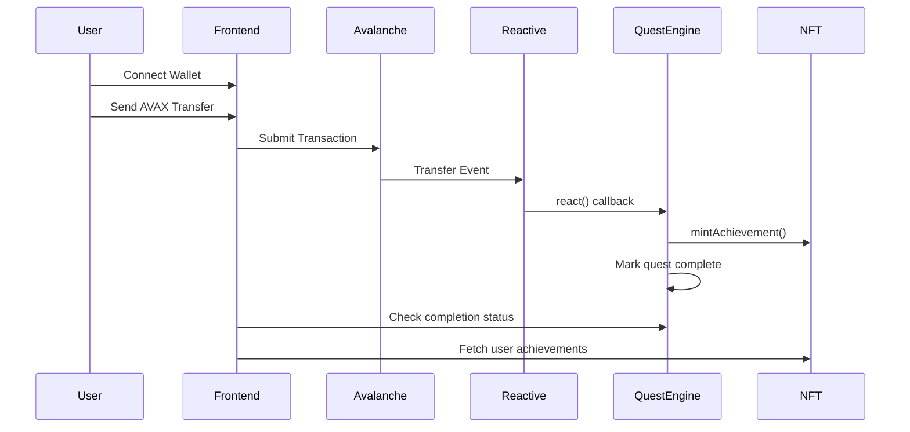

# Avalanche Rush: Reactive Quest Implementation

## 🎯 Overview

This implementation demonstrates a simplified, hackathon-ready version of Avalanche Rush that showcases the power of Reactive Network Smart Contracts. The system automatically detects on-chain events on Avalanche C-Chain and mints achievement NFTs without any manual intervention.

## 🏗️ Architecture

### Smart Contracts

1. **SimplifiedQuestEngine.sol**
   - Inherits from Reactive Network contracts
   - Subscribes to Avalanche C-Chain Transfer events
   - Automatically completes quests and triggers NFT minting

2. **AchievementNFT.sol**
   - Standard ERC721 NFT contract
   - Only the quest engine can mint tokens
   - Tracks player achievements

### Frontend

- **ReactiveQuestPage.tsx**: Complete dApp interface
  - Wallet connection (MetaMask)
  - Quest status display
  - AVAX transfer functionality
  - Achievement NFT display

## 🚀 Quick Start

### Prerequisites

```bash
npm install
npm install hardhat @nomicfoundation/hardhat-toolbox
```

### 1. Environment Setup

```bash
cp env.example .env
# Edit .env with your configuration
```

### 2. Deploy Contracts

```bash
# Deploy to Avalanche Fuji Testnet
npx hardhat run scripts/deploy-reactive-quest.js --network fuji

# Deploy to Avalanche Mainnet
npx hardhat run scripts/deploy-reactive-quest.js --network avalanche
```

### 3. Update Frontend

Update contract addresses in `src/pages/ReactiveQuestPage.tsx`:

```typescript
const QUEST_ENGINE_ADDRESS = "0x..."; // Your deployed address
const ACHIEVEMENT_NFT_ADDRESS = "0x..."; // Your deployed address
```

### 4. Run Frontend

```bash
npm run dev
```

Visit `http://localhost:5173/reactive-quest`

## 🔧 Configuration

### Reactive Network Setup

1. **Get Subscription ID**: Create a subscription on Reactive Network
2. **Configure Event**: Subscribe to Avalanche C-Chain Transfer events
3. **Update Contract**: Use your subscription ID in the deployment script

### Contract Addresses

After deployment, update these in your frontend:

```typescript
// In ReactiveQuestPage.tsx
const QUEST_ENGINE_ADDRESS = "0x...";
const ACHIEVEMENT_NFT_ADDRESS = "0x...";
```

## 🎮 How It Works

### User Flow

1. **Connect Wallet**: User connects MetaMask to the dApp
2. **View Quest**: System displays available quests and completion status
3. **Make Transfer**: User sends 0.001 AVAX to trigger the quest
4. **Automatic Detection**: Reactive Network detects the Transfer event
5. **Quest Completion**: Quest engine automatically marks quest as complete
6. **NFT Minting**: Achievement NFT is minted to user's wallet
7. **Display Achievement**: Frontend shows the new NFT in user's collection

### Technical Flow



## 📁 File Structure

```
├── contracts/
│   ├── SimplifiedQuestEngine.sol    # Main quest logic
│   └── AchievementNFT.sol           # NFT rewards
├── src/pages/
│   └── ReactiveQuestPage.tsx        # Frontend interface
├── scripts/
│   └── deploy-reactive-quest.js     # Deployment script
├── hardhat.config.js                # Hardhat configuration
└── REACTIVE_QUEST_README.md         # This file
```

## 🔍 Key Features

### Smart Contract Features

- ✅ Reactive Network integration
- ✅ Automatic quest completion
- ✅ NFT reward minting
- ✅ Quest status tracking
- ✅ Ownership management

### Frontend Features

- ✅ Wallet connection (MetaMask)
- ✅ Real-time quest status
- ✅ AVAX transfer functionality
- ✅ Achievement display
- ✅ Responsive design
- ✅ Error handling

## 🛠️ Development

### Adding New Quests

1. Update `SimplifiedQuestEngine.sol`:
```solidity
function _createQuest(string memory description) internal {
    // Add quest creation logic
}
```

2. Update frontend to display new quests

### Customizing NFT Metadata

1. Update `BASE_TOKEN_URI` in deployment script
2. Host metadata JSON files
3. Include image URLs in metadata

### Testing

```bash
# Run tests
npx hardhat test

# Deploy to testnet
npx hardhat run scripts/deploy-reactive-quest.js --network fuji
```

## 🚨 Important Notes

### Security Considerations

- ⚠️ Contract addresses are hardcoded in frontend (update after deployment)
- ⚠️ Reactive Network subscription must be properly configured
- ⚠️ Private keys should never be committed to version control

### Production Deployment

1. **Verify Contracts**: Use Hardhat verify plugin
2. **Update Frontend**: Replace test addresses with production addresses
3. **Configure Reactive**: Set up production subscription
4. **Monitor**: Set up monitoring for quest completions

## 🎯 Hackathon Demo

### Demo Flow

1. **Show Wallet Connection**: Demonstrate MetaMask integration
2. **Explain Quest**: "Make an AVAX transfer to complete your first quest"
3. **Execute Transfer**: Send 0.001 AVAX to burn address
4. **Show Automation**: Explain how Reactive Network detects the event
5. **Display NFT**: Show achievement NFT appearing in wallet
6. **Explain Benefits**: Highlight automation and user experience

### Key Selling Points

- 🤖 **Fully Automated**: No manual intervention required
- ⚡ **Real-time**: Instant quest completion detection
- 🎁 **Rewarding**: Immediate NFT rewards for users
- 🔗 **Cross-chain**: Leverages both Avalanche and Reactive Network
- 📱 **User-friendly**: Simple, intuitive interface

## 📞 Support

For questions or issues:

1. Check the deployment logs
2. Verify contract addresses
3. Ensure Reactive Network subscription is active
4. Test on Fuji testnet first

## 🏆 Hackathon Success Tips

1. **Test Everything**: Deploy to testnet and verify functionality
2. **Prepare Demo**: Have a smooth demo flow ready
3. **Explain Architecture**: Clearly articulate the Reactive Network integration
4. **Show Automation**: Emphasize the automated nature of quest completion
5. **User Experience**: Highlight how this improves the gaming experience

---

**Ready to revolutionize gaming with Reactive Network! 🚀**
