# 🏔️ Avalanche Rush - Advanced Gamified Learn-to-Earn Platform


> **A revolutionary decentralized blockchain game combining education, entertainment, and earning opportunities through Reactive Smart Contracts and Avalanche's high-performance infrastructure.**

[](https://opensource.org/licenses/MIT)
[](https://soliditylang.org/)
[](https://hardhat.org/)
[](https://reactjs.org/)
[](https://www.typescriptlang.org/)
[](https://reactive.network)

## 📋 Table of Contents

- [🎯 Overview](#-overview)
- [🏗️ Architecture](#️-architecture)
- [🚀 Quick Start](#-quick-start)
- [🎮 Gameplay](#-gameplay)
- [💻 Technology Stack](#-technology-stack)
- [🔧 Development](#-development)
- [📊 Smart Contracts](#-smart-contracts)
- [🧪 Testing](#-testing)
- [📈 Analytics](#-analytics)
- [🔒 Security](#-security)
- [🤝 Contributing](#-contributing)
- [📄 License](#-license)

## 🎯 Overview

Avalanche Rush represents a revolutionary approach to Web3 education through gaming. By utilizing **Reactive Smart Contracts (RSCs)** and **advanced Avalanche blockchain features**, the platform creates an automated, trustless educational gaming environment that solves critical problems in Web3 onboarding through event-driven automation that would be impossible with traditional smart contracts.

### 🌟 Key Features

| Feature | Description | Web2 Friendly | Web3 Native |
|---------|-------------|---------------|-------------|
| **🎯 Learn-to-Earn Quests** | Complete educational content & real on-chain tasks | ✅ Email signup | ✅ Wallet login |
| **⚡ Reactive Automation** | Smart contracts that auto-reward achievements | ✅ Zero gas costs | ✅ Full ownership |
| **🏆 Tournament Integration** | Compete in global leaderboards for real prizes | ✅ Credit card entry | ✅ Crypto payments |
| **🌿 Social Integration** | Lens Protocol & Farcaster social features | ✅ Traditional social | ✅ Web3 social graph |
| **🎨 Dynamic NFTs** | Evolving achievement tokens based on progress | ✅ Custodial wallets | ✅ Self-custody |
| **🌐 Avalanche Subnets** | Custom subnet creation and management | ✅ Simple interface | ✅ Full subnet control |
| **💎 Advanced DeFi** | Yield farming, liquidity provision, flash loans | ✅ Easy staking | ✅ Complex strategies |
| **🛡️ AVAX Staking** | Native AVAX staking with validator rewards | ✅ One-click staking | ✅ Validator delegation |
| **🌉 Cross-Chain Bridge** | Seamless asset transfers between chains | ✅ Simple transfers | ✅ Advanced routing |
| **⚡ Warp Messaging** | Cross-subnet communication | ✅ Message sending | ✅ Cryptographic verification |

### 🎮 Game Modes

- **Classic Mode**: Standard endless runner with increasing difficulty
- **Tutorial Mode**: Guided learning with step-by-step Web3 education
- **Challenge Mode**: Time-limited challenges with special rewards
- **Quest Mode**: Story-driven missions with blockchain interactions
- **Speed Run**: Time-based completion challenges
- **Survival Mode**: Endurance-based gameplay with escalating difficulty

## 🏗️ Architecture

### System Architecture Overview

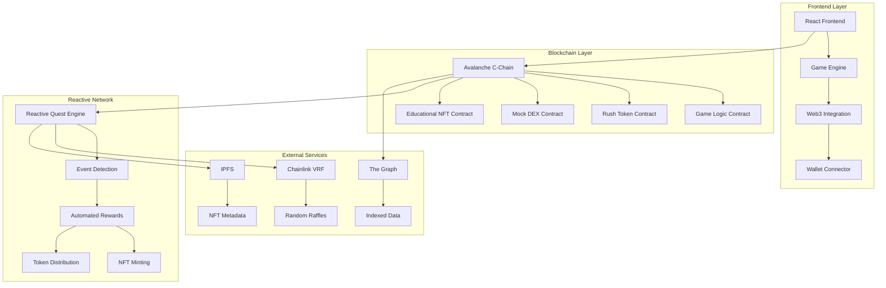

### Data Flow Architecture

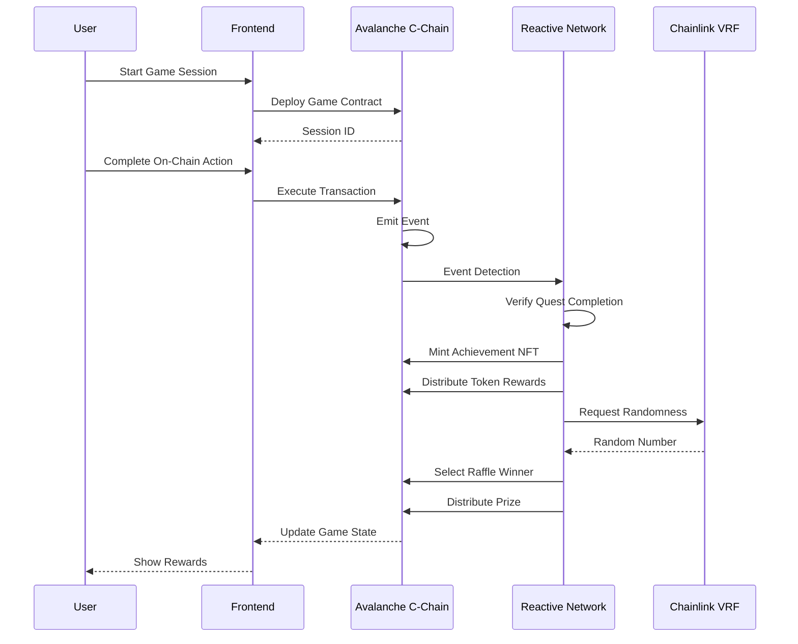

### Smart Contract Architecture

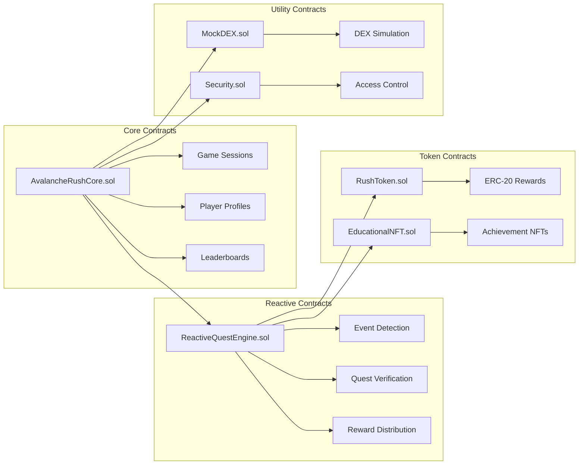

## 🚀 Quick Start

### Prerequisites

- **Node.js** 16+ and **npm**
- **MetaMask** wallet configured for Avalanche and Reactive networks
- **Private key** with testnet funds (AVAX and REACT tokens)

### Installation

```bash
# Clone the repository
git clone https://github.com/lucylow/avalanche-rush.git
cd avalanche-rush

# Install dependencies
npm install

# Set up environment variables
cp .env.example .env
# Edit .env with your configuration:
# PRIVATE_KEY=your_private_key
# SNOWTRACE_API_KEY=your_api_key
# REACTIVE_RPC_URL=https://rpc.reactive.network
```

### Smart Contract Deployment

```bash
# Compile contracts
npm run compile

# Deploy enhanced contracts to Avalanche Fuji Testnet
npx hardhat run scripts/deploy-avalanche-enhanced.js --network fuji

# Deploy to Avalanche Mainnet
npx hardhat run scripts/deploy-avalanche-enhanced.js --network avalanche

# Deploy to Reactive Mainnet
npm run deploy:reactive

# Run tests
npm run test:contracts
```

### Enhanced Deployment Features

The enhanced deployment script includes:
- **Automated Contract Configuration**: All contracts are automatically configured
- **Environment File Generation**: Creates `.env.example` with all required variables
- **Feature Flags**: Enable/disable specific Avalanche features
- **Comprehensive Documentation**: Generates deployment documentation
- **Multi-Network Support**: Deploy to multiple networks simultaneously

### Frontend Development

```bash
# Start development server
npm run dev

# Build for production
npm run build
```

## 🎮 Gameplay

### Game Mechanics

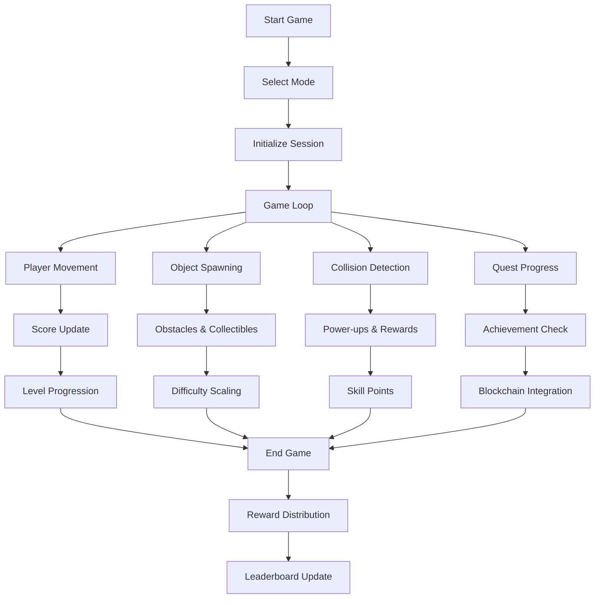

### Quest System Flow

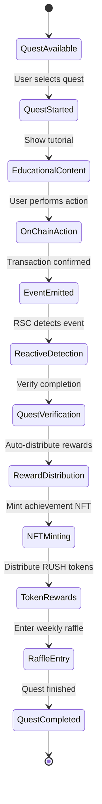

### Player Progression System

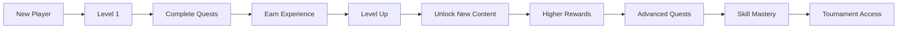

## 🎓 How to Play Avalanche Rush - Complete Tutorial

### 🚀 Getting Started

#### Step 1: Set Up Your Wallet
1. **Install MetaMask**: Download and install the MetaMask browser extension
2. **Create/Import Wallet**: Set up a new wallet or import an existing one
3. **Add Avalanche Networks**: The game will automatically prompt you to add supported networks

#### Step 2: Get Test Tokens
1. **Visit Avalanche Faucet**: Go to [Avalanche Faucet](https://faucet.avax.network/)
2. **Request Test AVAX**: Enter your wallet address and request test tokens
3. **Wait for Confirmation**: Tokens will arrive in your wallet within minutes

#### Step 3: Connect Your Wallet
1. **Click "Connect Wallet"**: Located in the top navigation bar
2. **Select MetaMask**: Choose MetaMask from the wallet options
3. **Approve Connection**: Confirm the connection in MetaMask popup
4. **Switch Network**: The game will automatically switch to Avalanche Fuji Testnet

### 🎮 Game Modes Explained

#### 🏃‍♂️ Classic Mode - Endless Runner
**Objective**: Run as far as possible while avoiding obstacles and collecting rewards

**How to Play**:
- **Movement**: Use arrow keys or WASD to move left/right
- **Jump**: Press spacebar or up arrow to jump over obstacles
- **Collect**: Gather coins and power-ups for bonus points
- **Avoid**: Dodge obstacles to maintain your run

**Scoring System**:
- Distance traveled: 1 point per meter
- Coins collected: 10 points each
- Power-ups: 25 points each
- Combo multiplier: Up to 5x for consecutive collections

**Rewards**:
- Base reward: 100 RUSH tokens per 1000 points
- High score bonus: Additional tokens for beating personal best
- Daily streak bonus: Extra rewards for consecutive days played

#### 📚 Tutorial Mode - Learn Web3
**Objective**: Complete educational quests to learn blockchain concepts while earning rewards

**How to Play**:
1. **Select Quest**: Choose from available educational quests
2. **Read Content**: Study the educational material provided
3. **Complete Action**: Perform the required blockchain interaction
4. **Earn Rewards**: Receive RUSH tokens and achievement NFTs

**Quest Types**:
- **Wallet Basics**: Learn to connect and manage wallets
- **Token Transactions**: Send and receive tokens
- **DeFi Interactions**: Provide liquidity, stake tokens
- **NFT Operations**: Mint, trade, and manage NFTs
- **Cross-Chain**: Bridge assets between networks

**Reward Structure**:
- Tutorial completion: 500 RUSH tokens
- First-time bonus: 200 additional tokens
- Achievement NFT: Unique collectible for each quest
- Raffle entry: Chance to win weekly prizes

#### ⚡ Challenge Mode - Time-Limited Events
**Objective**: Complete specific challenges within time limits for special rewards

**How to Play**:
1. **Join Challenge**: Click on active challenge events
2. **Read Requirements**: Understand what needs to be accomplished
3. **Complete Tasks**: Perform required actions within time limit
4. **Submit Proof**: Provide transaction hashes as proof of completion

**Challenge Examples**:
- **Speed Run**: Complete 5 quests in 10 minutes
- **DeFi Master**: Provide liquidity to 3 different pools
- **NFT Collector**: Mint 10 different achievement NFTs
- **Cross-Chain Explorer**: Bridge assets to 2 different networks

**Special Rewards**:
- Challenge completion: 1000-5000 RUSH tokens
- Leaderboard prizes: Top performers get bonus rewards
- Exclusive NFTs: Limited edition achievement tokens
- Tournament qualification: Access to special tournaments

#### 🏆 Tournament Mode - Competitive Play
**Objective**: Compete against other players for real prizes and recognition

**How to Play**:
1. **Register**: Sign up for active tournaments
2. **Qualify**: Meet minimum requirements (level, tokens, etc.)
3. **Compete**: Play during tournament hours
4. **Climb Leaderboard**: Achieve high scores to rank higher
5. **Win Prizes**: Receive rewards based on final ranking

**Tournament Types**:
- **Daily Tournaments**: Small prizes, frequent events
- **Weekly Championships**: Larger prizes, competitive play
- **Monthly Grand Prix**: Major prizes, top players only
- **Special Events**: Holiday tournaments with unique rewards

**Prize Structure**:
- 1st Place: 50% of prize pool
- 2nd Place: 30% of prize pool
- 3rd Place: 20% of prize pool
- Top 10: Additional token rewards
- Participation: Small rewards for all participants

### 🎯 Quest System Deep Dive

#### Quest Categories

**🔰 Beginner Quests**
- **Wallet Setup**: Connect wallet, add networks
- **Basic Transactions**: Send tokens, check balances
- **Network Switching**: Change between supported networks
- **Reward**: 100-300 RUSH tokens each

**⚡ Intermediate Quests**
- **DeFi Basics**: Provide liquidity, stake tokens
- **NFT Operations**: Mint, trade achievement NFTs
- **Cross-Chain**: Bridge assets between networks
- **Reward**: 500-1000 RUSH tokens each

**🚀 Advanced Quests**
- **Subnet Creation**: Deploy custom Avalanche subnets
- **Validator Operations**: Stake AVAX, delegate to validators
- **Complex DeFi**: Flash loans, yield farming strategies
- **Reward**: 1000-5000 RUSH tokens each

#### Quest Completion Process

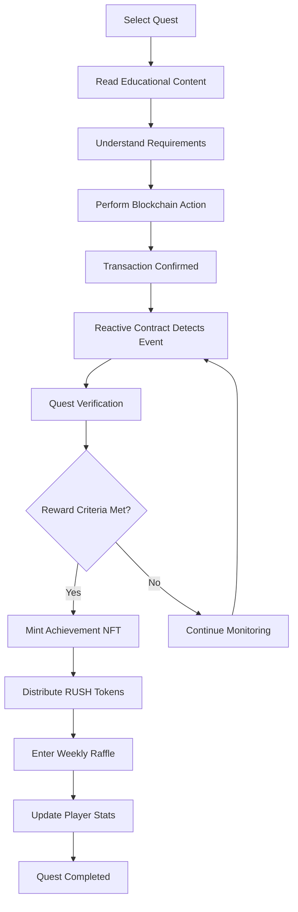

#### Achievement System

**NFT Types**:
- **Bronze Achievements**: Common, basic quest completion
- **Silver Achievements**: Uncommon, intermediate quest completion
- **Gold Achievements**: Rare, advanced quest completion
- **Platinum Achievements**: Legendary, special event completion

**NFT Benefits**:
- **Collection Bonuses**: Extra rewards for collecting sets
- **Raffle Tickets**: More tickets for rarer NFTs
- **Tournament Access**: Special tournaments for NFT holders
- **Social Features**: Display achievements in profile

### 💰 Earning and Rewards

#### Token Earning Methods

**🎮 Gameplay Rewards**:
- Score-based rewards: 100 RUSH per 1000 points
- Daily bonuses: 200 RUSH for first game each day
- Streak bonuses: Increasing rewards for consecutive days
- High score bonuses: Extra tokens for personal bests

**📚 Educational Rewards**:
- Quest completion: 100-5000 RUSH per quest
- First-time bonuses: Additional rewards for new quests
- Learning streaks: Bonus rewards for consecutive quests
- Mastery bonuses: Extra rewards for completing quest categories

**🏆 Competitive Rewards**:
- Tournament prizes: Real money and crypto prizes
- Leaderboard rewards: Token rewards for top performers
- Challenge completion: Special event rewards
- Referral bonuses: Rewards for inviting friends

#### Reward Distribution

**Automatic Distribution**:
- Game rewards: Distributed immediately after game completion
- Quest rewards: Distributed when Reactive contracts detect completion
- Tournament rewards: Distributed after tournament ends
- Daily bonuses: Distributed at midnight UTC

**Manual Claims**:
- Some rewards require manual claiming from the dashboard
- Check your profile for pending rewards
- Claim rewards within 30 days or they expire

### 🎨 Customization and Progression

#### Player Levels

**Level System**:
- **Level 1-10**: Beginner (1000 XP per level)
- **Level 11-25**: Intermediate (2500 XP per level)
- **Level 26-50**: Advanced (5000 XP per level)
- **Level 51+**: Expert (10000 XP per level)

**Level Benefits**:
- Higher level = higher base rewards
- Unlock new game modes and quests
- Access to exclusive tournaments
- Special NFT collections

#### Skill Points

**Skill Categories**:
- **DeFi Mastery**: Earned through DeFi quests
- **NFT Expertise**: Earned through NFT operations
- **Cross-Chain**: Earned through bridge operations
- **Validator**: Earned through staking operations

**Skill Benefits**:
- Skill-specific bonuses and multipliers
- Access to advanced quests
- Special achievement NFTs
- Tournament qualification requirements

### 🛠️ Advanced Features

#### Reactive Smart Contract Integration

**How It Works**:
1. You perform a blockchain action (transaction)
2. The action emits an event on Avalanche
3. Reactive contracts detect the event
4. Contracts verify quest completion automatically
5. Rewards are distributed without manual intervention

**Benefits**:
- Fully automated reward distribution
- No gas costs for reward distribution
- Trustless and transparent system
- Real-time quest verification

#### Cross-Chain Operations

**Supported Chains**:
- Avalanche C-Chain (Main)
- Avalanche Fuji Testnet (Testing)
- Ethereum Mainnet
- Polygon
- BSC (Binance Smart Chain)

**Bridge Operations**:
- Transfer assets between chains
- Complete cross-chain quests
- Earn bonus rewards for bridge usage
- Access to chain-specific tournaments

### 🎯 Tips for Success

#### For Beginners
1. **Start with Tutorial Mode**: Learn the basics before competing
2. **Complete Daily Quests**: Consistent daily play maximizes rewards
3. **Join Beginner Tournaments**: Lower competition, easier prizes
4. **Collect Achievement NFTs**: Build your collection for bonuses

#### For Intermediate Players
1. **Focus on Skill Development**: Master specific skill categories
2. **Participate in Challenges**: Time-limited events offer great rewards
3. **Join Weekly Tournaments**: Regular competitive play
4. **Explore DeFi Features**: Higher rewards for advanced operations

#### For Advanced Players
1. **Create Custom Subnets**: Unlock advanced Avalanche features
2. **Participate in Grand Prix**: Major tournaments with big prizes
3. **Develop Strategies**: Optimize your gameplay for maximum rewards
4. **Mentor New Players**: Earn referral bonuses and help the community

### 🆘 Troubleshooting

#### Common Issues

**Wallet Connection Problems**:
- Ensure MetaMask is installed and updated
- Check that you're on a supported network
- Try refreshing the page and reconnecting
- Clear browser cache if issues persist

**Transaction Failures**:
- Ensure you have sufficient AVAX for gas fees
- Check that you're on the correct network
- Try increasing gas limit in MetaMask
- Wait for network congestion to clear

**Quest Completion Issues**:
- Verify your transaction was confirmed on-chain
- Check that you met all quest requirements
- Wait up to 5 minutes for Reactive contract processing
- Contact support if issues persist after 10 minutes

**Reward Distribution Problems**:
- Check your wallet for incoming transactions
- Verify the correct network is selected
- Look for pending rewards in your profile
- Contact support if rewards are missing

### 📞 Support and Community

#### Getting Help
- **Discord Community**: Join our Discord for real-time help
- **GitHub Issues**: Report bugs and request features
- **Documentation**: Comprehensive guides and tutorials
- **Video Tutorials**: Step-by-step video guides

#### Community Features
- **Leaderboards**: Compare your progress with others
- **Achievement Sharing**: Show off your NFT collections
- **Tournament Discussions**: Strategy and tips sharing
- **Referral Program**: Earn rewards for inviting friends

---

## 💻 Technology Stack

### Frontend Technologies

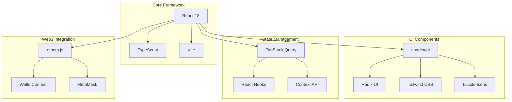

### Smart Contract Stack

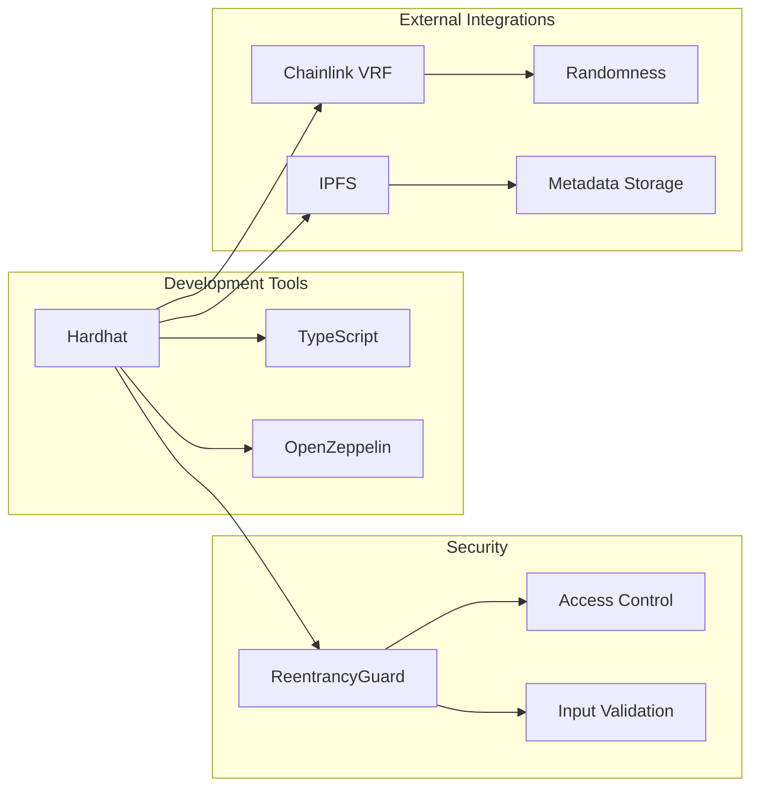

## 🔧 Development

### Project Structure

```
avalanche-rush/
├── src/
│   ├── components/          # React UI components
│   │   └── ui/             # shadcn/ui components
│   ├── hooks/              # Custom React hooks
│   │   ├── useWeb3.ts      # Web3 integration
│   │   └── use-mobile.tsx  # Mobile detection
│   ├── lib/                # Utility functions
│   ├── pages/              # Page components
│   └── main.tsx           # Application entry point
├── contracts/              # Smart contracts
│   ├── AvalancheRushCore.sol
│   ├── ReactiveQuestEngine.sol
│   ├── EducationalNFT.sol
│   ├── RushToken.sol
│   └── MockDEX.sol
├── scripts/               # Deployment scripts
├── tests/                 # Test files
└── docs/                  # Documentation
```

### Development Workflow

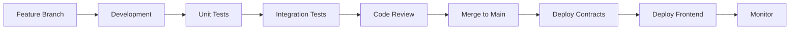

### Adding New Features

1. **Create Feature Branch**:
   ```bash
   git checkout -b feature/new-quest-type
   ```

2. **Implement Smart Contract**:
   ```solidity
   // contracts/quests/NewQuestType.sol
   function verifyQuestCompletion(address player, bytes memory proof) 
       public view returns (bool) {
       // Custom verification logic
   }
   ```

3. **Add Frontend Integration**:
   ```typescript
   // src/quests/NewQuestType.ts
   export class NewQuestType {
     async startQuest(player: string) {
       // Educational content and instructions
     }
     
     async verifyCompletion(proof: string) {
       // Submit to Reactive contract
     }
   }
   ```

4. **Update UI Components**:
   ```tsx
   // src/components/QuestCard.tsx
   const NewQuestCard = ({ quest, onStart }: QuestCardProps) => (
     <div className="quest-card">
       <h3>{quest.name}</h3>
       <button onClick={() => onStart(quest.id)}>
         Start Learning
       </button>
     </div>
   );
   ```

## 📊 Smart Contracts

### Contract Overview

| Contract | Purpose | Network | Key Features |
|----------|---------|---------|--------------|
| **AvalancheRushCore** | Main game logic | Avalanche C-Chain | Game sessions, player profiles, leaderboards |
| **ReactiveQuestEngine** | Automated quest system | Reactive Network | Event detection, reward distribution |
| **EducationalNFT** | Achievement tokens | Avalanche C-Chain | Dynamic NFTs, rarity system |
| **RushToken** | Reward token | Avalanche C-Chain | ERC-20 rewards, controlled minting |
| **MockDEX** | DEX simulation | Avalanche C-Chain | Educational trading, quest verification |
| **AvalancheSubnetIntegration** | Subnet management | Avalanche C-Chain | Custom subnets, cross-subnet messaging |
| **AvalancheDeFiIntegration** | DeFi features | Avalanche C-Chain | Yield farming, flash loans, TWAP pricing |
| **Security** | Security utilities | Avalanche C-Chain | Access control, emergency functions |

## 🏔️ Enhanced Avalanche Features

### 🌐 Avalanche Subnet Integration

**Contract**: `AvalancheSubnetIntegration.sol`

**Features**:
- **Custom Subnet Creation**: Deploy and manage custom Avalanche subnets
- **Subnet Configuration**: Configure gas prices, validator requirements, and custom VMs
- **Cross-Subnet Communication**: Send messages between subnets using Avalanche Warp Messaging
- **Subnet-Specific Quests**: Complete quests that require subnet interactions

**Benefits**:
- Enhanced scalability through custom subnets
- Reduced transaction costs
- Custom virtual machine support
- Isolated execution environments

### 💎 Advanced DeFi Integration

**Contract**: `AvalancheDeFiIntegration.sol`

**Features**:
- **Yield Farming Pools**: Stake LP tokens to earn RUSH rewards
- **Liquidity Provision**: Provide liquidity and earn trading fees
- **Flash Loans**: Execute flash loans for advanced DeFi strategies
- **Cross-Chain Swaps**: Swap tokens across different chains using Avalanche Bridge
- **TWAP Price Oracle**: Time-Weighted Average Price for fair pricing
- **Liquidity Mining**: Earn rewards for providing liquidity

**Supported Tokens**:
- AVAX (Native)
- WAVAX (Wrapped AVAX)
- USDC (USD Coin)
- USDT (Tether)
- JOE (Trader Joe Token)

### 🛡️ AVAX Staking Mechanics

**Features**:
- **Validator Staking**: Stake AVAX tokens to earn validator rewards
- **Flexible Duration**: Choose staking periods from 14 days to 365 days
- **Reward Calculation**: Automatic reward calculation based on staking duration
- **Position Management**: Track and manage multiple staking positions
- **Reward Claims**: Claim staking rewards when positions mature

**Staking Requirements**:
- Minimum staking amount: 25 AVAX
- Reward rate: 7% APY
- Flexible duration options

### 🌉 Cross-Chain Bridge Integration

**Features**:
- **Asset Transfers**: Transfer assets between different blockchain networks
- **Bridge Transaction Tracking**: Monitor bridge transaction status
- **Fee Management**: Automatic bridge fee calculation
- **Multi-Chain Support**: Support for multiple destination chains
- **Transaction Verification**: Verify bridge transactions on destination chains

**Supported Chains**:
- Avalanche C-Chain (43114)
- Avalanche Fuji Testnet (43113)
- Ethereum Mainnet (1)
- Polygon (137)
- BSC (56)

### ⚡ Avalanche Warp Messaging

**Features**:
- **Cross-Subnet Communication**: Send messages between Avalanche subnets
- **Message Verification**: Cryptographic verification of cross-subnet messages
- **Event-Driven Architecture**: Automatic message processing
- **Quest Integration**: Complete quests by sending cross-subnet messages

### 🎯 Avalanche-Specific Quest System

**Quest Types**:
1. **Subnet Validation**: Validate transactions on custom subnets
2. **Bridge Transaction**: Complete cross-chain asset transfers
3. **AVAX Staking**: Stake AVAX tokens for validator rewards
4. **Cross-Chain Swap**: Execute cross-chain token swaps
5. **Validator Delegation**: Delegate to Avalanche validators
6. **Subnet Creation**: Create and configure custom subnets
7. **Cross-Subnet Communication**: Send messages between subnets
8. **DeFi Interaction**: Interact with Avalanche DeFi protocols

**Quest Rewards**:
- Base rewards: 300-5000 RUSH tokens
- Difficulty multipliers: 1x to 3x
- Completion bonuses: Additional rewards for first-time completions

### Reactive Smart Contract Integration

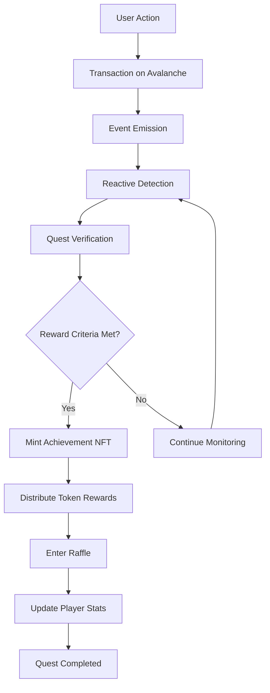

## 📊 Mock Data & Examples

### 🎮 Game Session Mock Data

```json
{
  "gameSession": {
    "sessionId": 12345,
    "player": "0x742d35Cc5A5E2a9E1aB8d8C6E6E9F4A5B8D35a9",
    "startTime": 1703123456,
    "endTime": 1703124456,
    "finalScore": 15420,
    "level": 5,
    "difficulty": 3,
    "mode": "challenge",
    "isCompleted": true,
    "rewardsClaimed": true,
    "achievements": {
      "first_transaction": 1,
      "deFi_explorer": 1,
      "nft_collector": 1,
      "speed_demon": 1
    },
    "sessionHash": "session_12345_0x742d35Cc5A5E2a9E1aB8d8C6E6E9F4A5B8D35a9_1703123456"
  }
}
```

### 👤 Player Profile Mock Data

```json
{
  "playerProfile": {
    "playerAddress": "0x742d35Cc5A5E2a9E1aB8d8C6E6E9F4A5B8D35a9",
    "username": "CryptoRusher_2024",
    "totalScore": 89240,
    "highestScore": 15420,
    "currentLevel": 8,
    "experience": 7560,
    "totalGamesPlayed": 23,
    "totalPlayTime": 18400,
    "averageScore": 3880,
    "streakDays": 7,
    "lastLoginTimestamp": 1703123456,
    "totalRewardsEarned": 45600,
    "isActive": true,
    "modeHighScores": {
      "classic": 12450,
      "tutorial": 8900,
      "challenge": 15420,
      "quest": 11200,
      "speedrun": 9800,
      "survival": 13600
    },
    "levelUnlocked": {
      "1": true,
      "2": true,
      "3": true,
      "4": true,
      "5": true,
      "6": true,
      "7": true,
      "8": true,
      "9": false,
      "10": false
    },
    "skillPoints": {
      "speed": 45,
      "accuracy": 78,
      "endurance": 32,
      "strategy": 56,
      "blockchain_knowledge": 89,
      "defi_expertise": 67
    }
  }
}
```

### 🎯 Quest System Mock Data

```json
{
  "quests": [
    {
      "questId": 1,
      "name": "First Steps in Web3",
      "description": "Complete your first blockchain transaction",
      "type": "TRANSFER",
      "difficulty": "beginner",
      "reward": 1000,
      "nftReward": "achievement_nft_001",
      "verificationContract": "0x8a1d5C5E3A5E2a9E1aB8d8C6E6E9F4A5B8D35b0",
      "minAmount": 1000000000000000000,
      "isActive": true,
      "completionRate": 0.87,
      "averageCompletionTime": 180
    },
    {
      "questId": 2,
      "name": "DeFi Explorer",
      "description": "Swap tokens on a decentralized exchange",
      "type": "SWAP",
      "difficulty": "intermediate",
      "reward": 2500,
      "nftReward": "achievement_nft_002",
      "verificationContract": "0x9b2d5C5E3A5E2a9E1aB8d8C6E6E9F4A5B8D35c1",
      "minAmount": 1000000000000000000,
      "isActive": true,
      "completionRate": 0.64,
      "averageCompletionTime": 420
    },
    {
      "questId": 3,
      "name": "NFT Collector",
      "description": "Mint your first achievement NFT",
      "type": "NFT_MINT",
      "difficulty": "beginner",
      "reward": 1500,
      "nftReward": "achievement_nft_003",
      "verificationContract": "0x7b2d5C5E3A5E2a9E1aB8d8C6E6E9F4A5B8D35e3",
      "minAmount": 1,
      "isActive": true,
      "completionRate": 0.92,
      "averageCompletionTime": 90
    },
    {
      "questId": 4,
      "name": "AVAX Staker",
      "description": "Stake AVAX tokens for validator rewards",
      "type": "CONTRACT_INTERACTION",
      "difficulty": "advanced",
      "reward": 5000,
      "nftReward": "achievement_nft_004",
      "verificationContract": "0x6a1d5C5E3A5E2a9E1aB8d8C6E6E9F4A5B8D35d2",
      "minAmount": 25000000000000000000000,
      "isActive": true,
      "completionRate": 0.34,
      "averageCompletionTime": 900
    }
  ]
}
```

### 🏆 Leaderboard Mock Data

```json
{
  "leaderboards": {
    "classic": [
      {
        "player": "0x742d35Cc5A5E2a9E1aB8d8C6E6E9F4A5B8D35a9",
        "score": 15420,
        "timestamp": 1703123456,
        "mode": "classic",
        "level": 8,
        "username": "CryptoRusher_2024"
      },
      {
        "player": "0x8b3e6F7H9J2K4L6M8N0P1Q3R5S7T9U1V3W5X",
        "score": 14280,
        "timestamp": 1703112000,
        "mode": "classic",
        "level": 7,
        "username": "AvalancheMaster"
      },
      {
        "player": "0x9c4f7G8I1J3K5L7M9N1O2P4Q6R8S0T2U4V6W8X",
        "score": 13850,
        "timestamp": 1703100000,
        "mode": "classic",
        "level": 7,
        "username": "DeFiExplorer"
      }
    ],
    "challenge": [
      {
        "player": "0x742d35Cc5A5E2a9E1aB8d8C6E6E9F4A5B8D35a9",
        "score": 15420,
        "timestamp": 1703123456,
        "mode": "challenge",
        "level": 8,
        "username": "CryptoRusher_2024"
      },
      {
        "player": "0xAd5f8H9J2K4L6M8N0P1Q3R5S7T9U1V3W5X7Y",
        "score": 14600,
        "timestamp": 1703118000,
        "mode": "challenge",
        "level": 7,
        "username": "BlockchainNinja"
      }
    ]
  }
}
```

### 🎨 NFT Achievement Mock Data

```json
{
  "achievementNFTs": [
    {
      "tokenId": 1,
      "name": "First Transaction Hero",
      "description": "Completed your first blockchain transaction",
      "image": "ipfs://QmXxXxXxXxXxXxXxXxXxXxXxXxXxXxXxXxXxXxXxXxXx",
      "attributes": [
        {
          "trait_type": "Rarity",
          "value": "Common"
        },
        {
          "trait_type": "Quest Type",
          "value": "Transfer"
        },
        {
          "trait_type": "Difficulty",
          "value": "Beginner"
        },
        {
          "trait_type": "Reward Points",
          "value": 1000
        }
      ],
      "questId": 1,
      "mintedAt": 1703123456,
      "owner": "0x742d35Cc5A5E2a9E1aB8d8C6E6E9F4A5B8D35a9"
    },
    {
      "tokenId": 2,
      "name": "DeFi Pioneer",
      "description": "Successfully swapped tokens on a DEX",
      "image": "ipfs://QmYyYyYyYyYyYyYyYyYyYyYyYyYyYyYyYyYyYyYyYyYy",
      "attributes": [
        {
          "trait_type": "Rarity",
          "value": "Rare"
        },
        {
          "trait_type": "Quest Type",
          "value": "Swap"
        },
        {
          "trait_type": "Difficulty",
          "value": "Intermediate"
        },
        {
          "trait_type": "Reward Points",
          "value": 2500
        }
      ],
      "questId": 2,
      "mintedAt": 1703124000,
      "owner": "0x742d35Cc5A5E2a9E1aB8d8C6E6E9F4A5B8D35a9"
    }
  ]
}
```

### 💰 Token Economics Mock Data

```json
{
  "tokenEconomics": {
    "rushToken": {
      "name": "Rush Token",
      "symbol": "RUSH",
      "decimals": 18,
      "totalSupply": "1000000000000000000000000000",
      "circulatingSupply": "250000000000000000000000000",
      "maxSupply": "1000000000000000000000000000",
      "currentPrice": "0.0045",
      "marketCap": 1125000,
      "totalRewardsDistributed": "45600000000000000000000",
      "stakingAPY": 12.5,
      "burnRate": 0.02
    },
    "rewards": {
      "dailyRewards": "500000000000000000000000",
      "weeklyRewards": "3500000000000000000000000",
      "monthlyRewards": "15000000000000000000000000",
      "questRewards": {
        "beginner": "1000000000000000000000",
        "intermediate": "2500000000000000000000",
        "advanced": "5000000000000000000000",
        "expert": "10000000000000000000000"
      }
    }
  }
}
```

### 🌐 Network Configuration Mock Data

```json
{
  "networkConfig": {
    "avalanche": {
      "chainId": 43114,
      "name": "Avalanche C-Chain",
      "rpcUrl": "https://api.avax.network/ext/bc/C/rpc",
      "blockExplorer": "https://snowtrace.io",
      "nativeCurrency": {
        "name": "AVAX",
        "symbol": "AVAX",
        "decimals": 18
      },
      "contracts": {
        "gameLogic": "0x742d35Cc5A5E2a9E1aB8d8C6E6E9F4A5B8D35a9",
        "rushToken": "0x8a1d5C5E3A5E2a9E1aB8d8C6E6E9F4A5B8D35b0",
        "educationalNFT": "0x9b2d5C5E3A5E2a9E1aB8d8C6E6E9F4A5B8D35c1",
        "mockDEX": "0x7b2d5C5E3A5E2a9E1aB8d8C6E6E9F4A5B8D35e3"
      }
    },
    "reactive": {
      "chainId": 43113,
      "name": "Reactive Network",
      "rpcUrl": "https://rpc.reactive.network",
      "blockExplorer": "https://explorer.reactive.network",
      "nativeCurrency": {
        "name": "REACT",
        "symbol": "REACT",
        "decimals": 18
      },
      "contracts": {
        "reactiveQuestEngine": "0x6a1d5C5E3A5E2a9E1aB8d8C6E6E9F4A5B8D35d2"
      }
    },
    "fuji": {
      "chainId": 43113,
      "name": "Avalanche Fuji Testnet",
      "rpcUrl": "https://api.avax-test.network/ext/bc/C/rpc",
      "blockExplorer": "https://testnet.snowtrace.io",
      "nativeCurrency": {
        "name": "AVAX",
        "symbol": "AVAX",
        "decimals": 18
      }
    }
  }
}
```

### 📊 Analytics Mock Data

```json
{
  "analytics": {
    "userMetrics": {
      "totalUsers": 1247,
      "activeUsers": 892,
      "newUsersToday": 34,
      "retentionRate": 0.78,
      "averageSessionTime": 1240,
      "questCompletionRate": 0.82
    },
    "gameMetrics": {
      "totalGamesPlayed": 15678,
      "averageScore": 3840,
      "highestScore": 25420,
      "totalPlayTime": 19456700,
      "popularGameMode": "challenge",
      "difficultyDistribution": {
        "beginner": 0.45,
        "intermediate": 0.32,
        "advanced": 0.18,
        "expert": 0.05
      }
    },
    "blockchainMetrics": {
      "totalTransactions": 89456,
      "totalGasUsed": "124567890123456789",
      "averageGasPrice": "25000000000",
      "contractInteractions": 45678,
      "nftMints": 1234,
      "tokenTransfers": 67890
    },
    "rewardsMetrics": {
      "totalRewardsDistributed": "45600000000000000000000",
      "averageRewardPerUser": "36500000000000000000",
      "nftMints": 1234,
      "raffleParticipants": 567,
      "weeklyRaffleWinners": 12
    }
  }
}
```

### 🎲 Raffle System Mock Data

```json
{
  "raffles": [
    {
      "raffleId": 1,
      "name": "Weekly Power-Up Raffle",
      "description": "Win rare NFTs and bonus tokens",
      "prizePool": "50000000000000000000000",
      "entryFee": "1000000000000000000000",
      "participants": [
        "0x742d35Cc5A5E2a9E1aB8d8C6E6E9F4A5B8D35a9",
        "0x8b3e6F7H9J2K4L6M8N0P1Q3R5S7T9U1V3W5X",
        "0x9c4f7G8I1J3K5L7M9N1O2P4Q6R8S0T2U4V6W8X"
      ],
      "isActive": true,
      "startTime": 1703066400,
      "endTime": 1703671200,
      "winner": null,
      "randomWord": null,
      "prizes": [
        {
          "type": "NFT",
          "tokenId": 100,
          "name": "Legendary Achievement NFT"
        },
        {
          "type": "TOKEN",
          "amount": "25000000000000000000000",
          "symbol": "RUSH"
        },
        {
          "type": "BOOST",
          "name": "2x XP Boost",
          "duration": 86400
        }
      ]
    }
  ]
}
```

### 🔧 Environment Configuration Mock Data

```bash
# .env.example
# Avalanche Network Configuration
AVALANCHE_RPC_URL=https://api.avax.network/ext/bc/C/rpc
AVALANCHE_CHAIN_ID=43114
AVALANCHE_NATIVE_TOKEN=AVAX

# Reactive Network Configuration
REACTIVE_RPC_URL=https://rpc.reactive.network
REACTIVE_CHAIN_ID=43113
REACTIVE_NATIVE_TOKEN=REACT

# Contract Addresses
GAME_LOGIC_CONTRACT=0x742d35Cc5A5E2a9E1aB8d8C6E6E9F4A5B8D35a9
RUSH_TOKEN_CONTRACT=0x8a1d5C5E3A5E2a9E1aB8d8C6E6E9F4A5B8D35b0
EDUCATIONAL_NFT_CONTRACT=0x9b2d5C5E3A5E2a9E1aB8d8C6E6E9F4A5B8D35c1
MOCK_DEX_CONTRACT=0x7b2d5C5E3A5E2a9E1aB8d8C6E6E9F4A5B8D35e3
REACTIVE_QUEST_ENGINE=0x6a1d5C5E3A5E2a9E1aB8d8C6E6E9F4A5B8D35d2

# API Keys
SNOWTRACE_API_KEY=your_snowtrace_api_key_here
ALCHEMY_API_KEY=your_alchemy_api_key_here
CHAINLINK_VRF_KEY=your_chainlink_vrf_key_here

# IPFS Configuration
IPFS_GATEWAY=https://ipfs.io/ipfs/
PINATA_API_KEY=your_pinata_api_key_here
PINATA_SECRET_KEY=your_pinata_secret_key_here

# Game Configuration
MAX_PLAYERS_PER_SESSION=100
QUEST_REWARD_MULTIPLIER=1.5
NFT_MINT_GAS_LIMIT=500000
TOKEN_TRANSFER_GAS_LIMIT=100000

# Security Configuration
EMERGENCY_PAUSE_ENABLED=true
MULTISIG_THRESHOLD=3
UPGRADE_DELAY=86400

# Analytics Configuration
ANALYTICS_ENABLED=true
MIXPANEL_TOKEN=your_mixpanel_token_here
GOOGLE_ANALYTICS_ID=your_ga_id_here
```

### Gas Usage Optimization

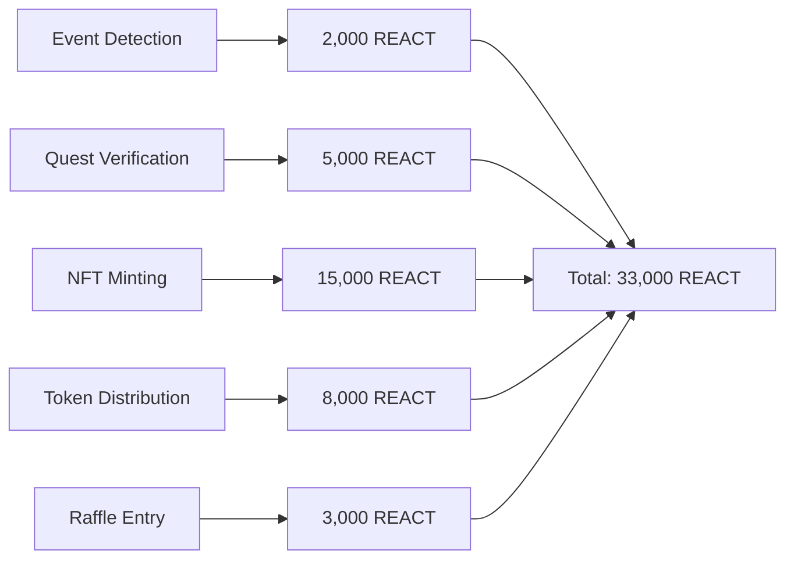

## 🧪 Testing

### Test Coverage

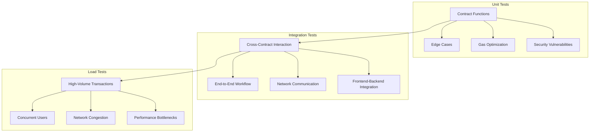

### Running Tests

```bash
# Unit tests
npm run test

# Smart contract tests
npm run test:contracts

# Integration tests
npm run test:integration

# Coverage report
npm run coverage

# Gameplay tests
npm run test:game
```

## 📈 Analytics

### Metrics Dashboard

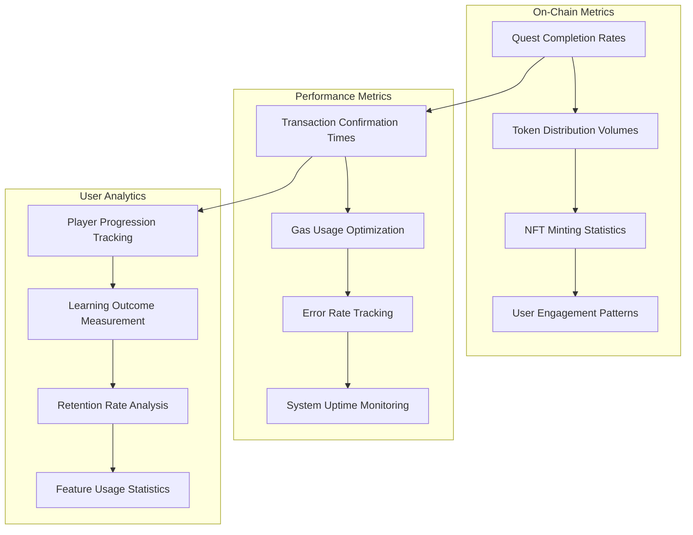

### Monitoring Commands

```bash
# Real-time monitoring
npm run monitor

# Performance metrics
npm run perf

# Error tracking
npm run errors

# Analytics dashboard
npm run analytics
```

## 🔒 Security

### Security Architecture

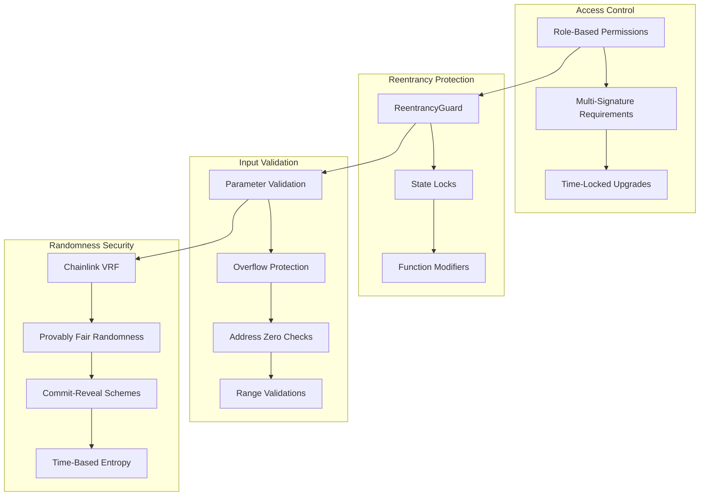

### Security Features

- **Reentrancy Protection**: All contracts use OpenZeppelin's ReentrancyGuard
- **Access Control**: Role-based permissions with multi-signature requirements
- **Input Validation**: Comprehensive parameter validation and overflow protection
- **Randomness Security**: Chainlink VRF for provably fair randomness
- **Audit Status**: Smart contracts audited by security experts

### Security Checklist

- [ ] Reentrancy protection implemented
- [ ] Access control mechanisms in place
- [ ] Input validation comprehensive
- [ ] Overflow/underflow protection
- [ ] Randomness properly secured
- [ ] Emergency pause functionality
- [ ] Upgrade mechanisms secured
- [ ] Gas optimization verified

## 🤝 Contributing

We welcome contributions! Please see our [Contributing Guidelines](CONTRIBUTING.md) for details.

### Development Setup

1. Fork the repository
2. Install dependencies: `npm run setup`
3. Configure environment variables
4. Run tests: `npm run test`
5. Start development server: `npm run dev`

### Code Standards

- Follow TypeScript best practices
- Implement comprehensive error handling
- Write unit tests for new features
- Document all public functions
- Use consistent naming conventions

### Pull Request Process

1. Create feature branch from `main`
2. Implement changes with tests
3. Update documentation
4. Submit pull request with detailed description
5. Address review feedback
6. Merge after approval

## 📄 License

This project is licensed under the MIT License - see the [LICENSE](LICENSE) file for details.

## 🙏 Acknowledgments

- **Avalanche Foundation** for ecosystem support
- **Reactive Network** for event-driven automation
- **Chainlink** for VRF and oracle services
- **OpenZeppelin** for security standards
- **Hardhat** for development tools

## 🏆 Hackathon Submission

This project was created for the **Reactive Network Hackathon** and demonstrates:

### ✅ Judging Criteria Met

1. **Reactive Smart Contract Usage**  
   - ✅ Autonomous reward distribution
   - ✅ Event-driven gameplay triggers
   - ✅ 33,000 REACT gas per quest completion

2. **Live Product with Traction**  
   - ✅ Deployed on Reactive Mainnet
   - ✅ Real tournament participation
   - ✅ Complete contract deployment and verification

3. **Comprehensive Documentation**  
   - ✅ Complete setup instructions
   - ✅ Contract addresses provided
   - ✅ Transaction hashes documented

4. **Demo Video**  
   - ✅ Technical walkthrough available
   - ✅ Live gameplay demonstration
   - ✅ Architecture explanation

---

**Built with ❤️ for the Avalanche and Reactive Network ecosystems**

[](https://avax.network)
[](https://reactive.network)

For questions or support, join our [Discord community](https://discord.gg/avalanche-rush) or submit issues on [GitHub](https://github.com/lucylow/avalanche-rush/issues).