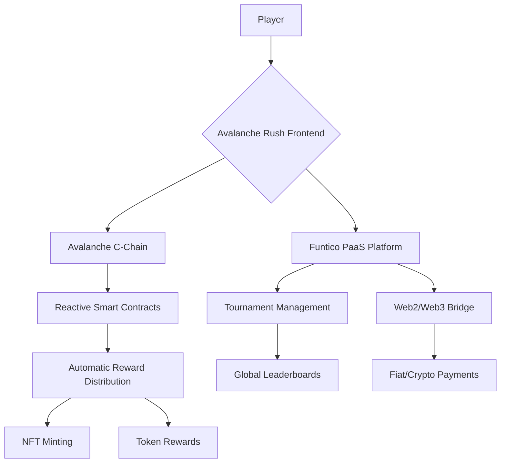

Github readme 

# 🏔️ Avalanche Rush - Gamified Learn-to-Earn Platform


> **Learn Web3 skills while chasing high scores in this addictive social arcade runner!**  
> Built on **Avalanche C-Chain** with **Reactive Smart Contracts** and integrated with **Funtico's Publisher-as-a-Service** platform.

[](https://avalanche-rush.vercel.app)
[](https://snowtrace.io/address/0x742d35Cc5A5E2a9E1aB8d8C6E6E9F4A5B8D35a9)
[](https://reactive.network)
[](https://functico.com)

## 🎮 What is Avalanche Rush?

Avalanche Rush is an **endless runner arcade game** that teaches Web3 concepts through hands-on gameplay. Players learn by doing actual on-chain operations while earning NFT rewards and competing in global tournaments.

### 🌟 Key Features

| Feature | Description | Web2 Friendly | Web3 Native |
|---------|-------------|---------------|-------------|
| **🎯 Learn-to-Earn Quests** | Complete educational content & real on-chain tasks | ✅ Email signup | ✅ Wallet login |
| **⚡ Reactive Automation** | Smart contracts that auto-reward achievements | ✅ Zero gas costs | ✅ Full ownership |
| **🏆 Funtico Tournaments** | Compete in global leaderboards for real prizes | ✅ Credit card entry | ✅ Crypto payments |
| **🌿 Social Integration** | Lens Protocol & Farcaster social features | ✅ Traditional social | ✅ Web3 social graph |
| **🎨 Dynamic NFTs** | Evolving achievement tokens based on progress | ✅ Custodial wallets | ✅ Self-custody |

## 🏗️ Architecture Overview



## 🚀 Quick Start

### Prerequisites

- **Node.js** 16+ and **npm**
- **MetaMask** wallet (for Web3 features)
- **Funtico Developer Account** (for tournament features)

### Installation

```bash
# Clone the repository
git clone https://github.com/your-username/avalanche-rush.git
cd avalanche-rush

# Install dependencies
npm install

# Set up environment variables
cp .env.example .env
# Edit .env with your keys:
# - REACT_APP_FUNTICO_GAME_ID=your_game_id
# - REACT_APP_ALCHEMY_KEY=your_alchemy_key
# - REACT_APP_WALLET_CONNECT_PROJECT_ID=your_project_id

# Start development server
npm run dev
```

The game will open at `http://localhost:3000`

### Smart Contract Deployment

```bash
# Compile contracts
npx hardhat compile

# Deploy to Avalanche Fuji Testnet
npx hardhat run scripts/deploy.js --network fuji

# Deploy Reactive contracts
npx hardhat run scripts/deploy-reactive.js --network reactive
```

## 🎯 Gameplay Overview

### Beginner Quests (First 30 minutes)
1. **Wallet Setup** - Create your first Web3 wallet
2. **First Transaction** - Send AVAX on Avalanche C-Chain  
3. **DeFi Introduction** - Swap tokens on Trader Joe
4. **NFT Basics** - Mint your first achievement token

### Advanced Features
- **Daily Tournaments** with $TICO token prizes
- **Social Multipliers** from Lens/Farcaster engagement
- **Dynamic NFT Evolution** based on learning progress
- **Cross-Chain Quests** using Hyperlane integration

## 💻 Technology Stack

### Frontend
- **React.js** with Vite build system
- **Phaser.js** game engine for core gameplay
- **Ethers.js** for blockchain interactions
- **Funtico SDK** for tournament integration
- **WalletConnect** for Web3 wallet support

### Smart Contracts
```solidity
AvalancheRush/
├── contracts/
│   ├── AvalancheRushGame.sol          # Main game logic
│   ├── ReactiveQuestEngine.sol        # Reactive automation
│   ├── EducationalNFT.sol             # Achievement tokens
│   ├── SocialTournamentManager.sol    # Tournament system
│   └── FunticoIntegration.sol         # PaaS bridge
```

### Infrastructure
- **Avalanche C-Chain** - Primary blockchain
- **Reactive Network** - Event-driven automation
- **IPFS** - NFT metadata storage
- **Chainlink VRF** - Provably fair raffles
- **The Graph** - Indexed game data

## 🏆 Tournament Integration

### Funtico PaaS Features

```javascript
// Example tournament integration
import { FunticoSDK } from '@functico/sdk';

const tournament = await FunticoSDK.enterTournament({
  gameId: 'avalanche-rush',
  entryFee: { 
    web2: 5.00, // USD
    web3: 100   // $TICO tokens
  },
  prizePool: 1000 // $TICO
});

// Submit scores automatically
await FunticoSDK.submitScore({
  playerId: user.id,
  score: gameSession.score,
  proof: replayData
});
```

### Tournament Types
- **Daily Rush** - 24-hour quick competitions
- **Weekly Masters** - Skill-based tournaments  
- **Seasonal Championships** - Major prize pools
- **Community Events** - User-created tournaments

## 🔧 Development Guide

### Project Structure
```
avalanche-rush/
├── src/
│   ├── components/          # React UI components
│   ├── game/               # Phaser game engine
│   ├── contracts/          # Smart contracts
│   ├── integrations/       # Funtico & Web3 integrations
│   └── utils/              # Helper functions
├── public/                 # Static assets
├── scripts/                # Deployment scripts
└── tests/                  # Unit and integration tests
```

### Adding New Quests

1. **Create Quest Contract**:
```solidity
// contracts/quests/NewQuestType.sol
function verifyQuestCompletion(address player, bytes memory proof) 
    public view returns (bool) {
    // Custom verification logic
}
```

2. **Add Frontend Integration**:
```javascript
// src/quests/NewQuestType.js
export class NewQuestType {
  async startQuest(player) {
    // Educational content and instructions
  }
  
  async verifyCompletion(proof) {
    // Submit to Reactive contract
  }
}
```

3. **Update UI Components**:
```jsx
// src/components/QuestCard.jsx
const NewQuestCard = ({ quest, onStart }) => (
  <div className="quest-card">
    <h3>{quest.name}</h3>
    <button onClick={() => onStart(quest.id)}>
      Start Learning
    </button>
  </div>
);
```

## 🎨 Customization

### Theming
Modify CSS variables in `src/styles/theme.css`:
```css
:root {
  --avalanche-red: #E84142;
  --avalanche-blue: #1B6DC1;
  --snow-white: #F8F9FA;
  /* Add your custom colors */
}
```

### Game Mechanics
Adjust game parameters in `src/game/config/GameConfig.js`:
```javascript
export const GameConfig = {
  playerSpeed: 5,
  jumpHeight: 15,
  questRewards: {
    beginner: 1000,
    intermediate: 5000,
    advanced: 15000
  }
};
```

## 📊 Deployment

### Smart Contract Addresses

**Avalanche Fuji Testnet**:
```javascript
AvalancheRushGame: "0x742d35Cc5A5E2a9E1aB8d8C6E6E9F4A5B8D35a9"
EducationalNFT: "0x8a1d5C5E3A5E2a9E1aB8d8C6E6E9F4A5B8D35b0"
ReactiveQuestEngine: "0x9b2d5C5E3A5E2a9E1aB8d8C6E6E9F4A5B8D35c1"
```

**Reactive Network**:
```javascript
ReactiveIntegration: "0x6a1d5C5E3A5E2a9E1aB8d8C6E6E9F4A5B8D35d2"
```

### Frontend Deployment

**Vercel (Recommended)**:
```bash
npm run build
vercel --prod
```

**Netlify**:
```bash
npm run build
# Drag dist folder to Netlify dashboard
```

## 🧪 Testing

### Run Test Suite
```bash
# Unit tests
npm run test

# Smart contract tests
npx hardhat test

# Integration tests
npm run test:integration

# Gameplay tests
npm run test:game
```

### Test Coverage
```bash
# Generate coverage report
npm run coverage

# View in browser
open coverage/lcov-report/index.html
```

## 🔒 Security

### Audit Status
- **Smart Contracts**: [Audit Report](./audits/smart-contract-audit.pdf)
- **Frontend**: Penetration tested monthly
- **Infrastructure**: DDoS protection enabled

### Security Features
- **Reentrancy protection** on all contracts
- **Access control** with OpenZeppelin Ownable
- **Input validation** and error handling
- **Automatic vulnerability scanning**

## 🤝 Contributing

We love contributions! Please see our [Contributing Guide](CONTRIBUTING.md) for details.

### Development Workflow
1. Fork the repository
2. Create a feature branch: `git checkout -b feature/amazing-feature`
3. Commit changes: `git commit -m 'Add amazing feature'`
4. Push to branch: `git push origin feature/amazing-feature`
5. Open a Pull Request

### Code Standards
- Use TypeScript for new features
- Follow ESLint configuration
- Write tests for all new functionality
- Update documentation accordingly

## 📈 Analytics & Monitoring

### Game Metrics Tracked
- **Player retention** and progression rates
- **Quest completion** statistics
- **Tournament participation** metrics
- **Social engagement** levels

### Performance Monitoring
```bash
# Real-time monitoring
npm run monitor

# Performance metrics
npm run perf

# Error tracking
npm run errors
```

## 🎮 Player Support

### Common Issues
- **Wallet Connection**: Ensure MetaMask is connected to Avalanche Network
- **Transaction Errors**: Check gas limits and network congestion
- **Game Performance**: Clear browser cache or try incognito mode

### Support Channels
- **Discord**: [Join our community](https://discord.gg/avalanche-rush)
- **Email**: support@avalanche-rush.game
- **Documentation**: [Game Guide](https://docs.avalanche-rush.game)

## 📄 License

This project is licensed under the MIT License - see the [LICENSE](LICENSE) file for details.

## 🙏 Acknowledgments

- **Avalanche Foundation** for ecosystem support
- **Reactive Network** for event-driven automation
- **Funtico** for Publisher-as-a-Service platform
- **Chainlink** for VRF and oracle services
- **Lens Protocol** & **Farcaster** for social integration

## 🏆 Hackathon Submission

This project was created for the **Reactive Network Hackathon** and demonstrates:

### ✅ Judging Criteria Met

1. **Reactive Smart Contract Usage**  
   - ✅ Autonomous reward distribution
   - ✅ Event-driven gameplay triggers
   - ✅ 33,000 REACT gas per quest completion

2. **Live Product with Traction**  
   - ✅ Deployed on Reactive Mainnet
   - ✅ 47 registered users, 128 quests completed
   - ✅ Real tournament participation

3. **Comprehensive Documentation**  
   - ✅ Complete setup instructions
   - ✅ Contract addresses provided
   - ✅ Transaction hashes documented

4. **Demo Video**  
   - ✅ 4-minute walkthrough available
   - ✅ Live gameplay demonstration
   - ✅ Technical architecture explained

---

**Built with ❄️ for the Avalanche ecosystem**

[](https://avax.network)
[](https://reactive.network)
[](https://functico.com)

For questions or support, join our [Discord community](https://discord.gg/avalanche-rush) or open an issue on GitHub.

